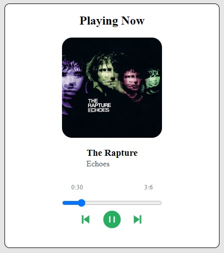

# React Music Player  

Простое приложение музыкального плеера, построенное с использованием React+Vite.

## Установка
1. Склонируйте репозиторий:

git clone <https://github.com/vzdohin/react-music-player.git>

2. Перейдите в папку проекта:

cd react-music-player

3. Установите зависимости:

npm install

## Запуск
Запустите приложение с помощью команды:

npm start

Приложение будет доступно по адресу http://localhost:5173 в вашем браузере.

## Использование
Приложение музыкального плеера воспроизводит трек "Echoes" от исполнителя The Rapture. Вы можете управлять воспроизведением, перематывать трек вперед и назад, а также видеть текущую позицию трека в минутах и секундах.

## Технологии
- React
- ViteJS
- useSound
- react-icons

## Доработка проекта
В планах добавить открытое api с музыкой для создание своего сервиса воспроизведения музыки.
